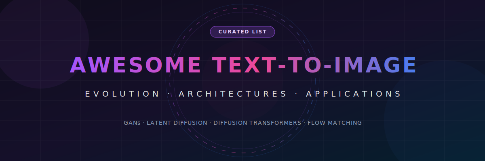
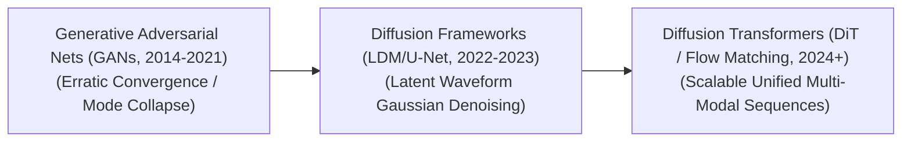

<!--
SEO Meta Tags:
- Title: Awesome Text-To-Image Models - Evolution, Architectures & Applications
- Description: A curated list of text-to-image (T2I) generative models, covering GANs, Latent Diffusion Models (LDM), Diffusion Transformers (DiT), Flow Matching, text conditioning, production challenges, and enterprise use-cases.
- Keywords: Text-to-Image, T2I, Generative AI, Diffusion Models, Latent Diffusion, Stable Diffusion, Diffusion Transformers, DiT, Flow Matching, GANs, CLIP, T5-XXL, ControlNet, DreamBooth
-->

# 🚀 Awesome Text-To-Image Models

  

  

## 📈 Text-to-Image Models: Evolution, Variants, Types, & Applications

Text-to-Image (T2I) generative models represent one of the most visible breakthroughs in artificial intelligence, converting open-ended natural language prompts into high-fidelity, compositionally accurate images. By mapping textual descriptions into visual feature matrices, these systems have evolved from generating blurry, low-resolution pixel grids to synthesising hyper-realistic, high-resolution masterpieces. The architecture has shifted structurally over time—transitioning from adversarial competition to text-aligned diffusion pathways and scalable transformer networks.

---

## 🕒 1. The Chronological Evolution

The technical progression of Text-to-Image models reflects a steady trajectory away from localized, unstable pixel architectures toward stable data density mappings and multi-scale visual token spaces.

| Era | Concept & Details | Year First Used | First Paper |
| :--- | :--- | :--- | :--- |
| [**The Adversarial Competition Era (~2014–2021)**](details/adversarial_competition.md) | **Concept:** Dominated by early models like StackGAN and AttnGAN, built on **Generative Adversarial Networks (GANs)**. A Generator network attempts to synthesize an image from a text embedding, while a Discriminator network evaluates whether the image is real or fake.  **Limitation:** Highly volatile to train, prone to **Mode Collapse** (where the model repeats identical outputs), and structurally incapable of capturing complex global spatial reasoning described in long sentences. | 2016 | [Generative Adversarial Text to Image Synthesis](https://arxiv.org/abs/1605.05396) |
| [**The Latent Diffusion & U-Net Era (~2022–2023)**](details/latent_diffusion_unet.md) | **Concept:** Popularized by OpenAI's DALL-E 2 and Stability AI's **Stable Diffusion (v1.5/v2.1)**. Instead of working directly on raw pixels, it utilizes a Variational Autoencoder (VAE) to compress images into a lower-dimensional latent space. A convolutional **U-Net** backbone iteratively strips away Gaussian noise over a series of time-steps, guided by text embeddings via cross-attention.  **Significance:** Democratic access to generation. Drastically reduced the computational compute overhead, allowing high-quality image generation to execute on consumer-grade GPUs. | 2022 | [High-Resolution Image Synthesis with Latent Diffusion Models](https://arxiv.org/abs/2112.10752) |
| [**The Diffusion Transformer & Flow Matching Era (~2024–Present)**](details/diffusion_transformer_flow_matching.md) | **Concept:** Pioneered by architectures like Sora, Stable Diffusion 3, Midjourney v6, and Black Forest Labs' FLUX series. It entirely replaces the convolutional U-Net with a **Diffusion Transformer (DiT)** backbone. Images are sliced into structural patches (patchified) and processed exactly like sentence tokens, optimized via straight-line **Flow Matching** mathematical trajectories. | 2023 | [Scalable Diffusion Models with Transformers](https://arxiv.org/abs/2212.09748) |

---

## 🧠 2. Core Generative & Architectural Variants

Text-to-Image architectures are strictly categorized based on the underlying mathematical frameworks they deploy to map text to pixel fields.

| Variant | Mechanism & Details | Year First Used | First Paper |
| :--- | :--- | :--- | :--- |
| [**Autoregressive Text-to-Image Models**](details/autoregressive_models.md) | **Mechanism:** Treats image generation exactly like text completion. Images are quantized into a discrete sequence of visual codebook tokens (using vector quantization like VQ-GAN). The transformer model reads a text prompt and generates visual tokens sequentially, token-by-token.  **Examples:** DALL-E (Original), Parti, and Muse. | 2021 | [Zero-Shot Text-to-Image Generation](https://arxiv.org/abs/2102.12092) |
| [**Latent Diffusion Models (LDM)**](details/latent_diffusion_models.md) | **Mechanism:** Operates within a compressed mathematical manifold. It trains a text-conditioned neural network to predict and remove noise distributions iteratively from a latent representation matrix before upscaling via a decoder.  **Examples:** Stable Diffusion 1.5/2.1/XL and Runway Gen-2. | 2022 | [High-Resolution Image Synthesis with Latent Diffusion Models](https://arxiv.org/abs/2112.10752) |
| [**Rectified Flow / Flow Matching Transformers**](details/rectified_flow_flow_matching.md) | **Mechanism:** Replaces traditional curved Gaussian denoising pathways with linear, straight ordinary differential equation (ODE) vector trajectories.  **Pros:** Significantly accelerates generation speed, requiring fewer inference steps (e.g., 4 to 10 steps) to generate crisp, high-fidelity compositions.  **Examples:** Stable Diffusion 3.5, FLUX.1, and Hunyuan-DiT. | 2022 | [Flow Matching for Generative Modeling](https://arxiv.org/abs/2210.02747) |

---

## 🔤 3. Text Ingestion & Conditioning Types

How the text prompt is understood and fed to the visual generation engine heavily dictates the final model's prompt adherence and text-rendering accuracy.

| Type | Profile & Behavior | Year First Used | First Paper |
| :--- | :--- | :--- | :--- |
| [**CLIP Conditioning (Contrastive Guidance)**](details/clip_conditioning.md) | **Profile:** Uses text encoders from pre-trained contrastive models (like OpenAI's CLIP).  **Behavior:** Exceptional at capturing global aesthetic styles and raw object classifications, but frequently struggles to process complex syntax, word order, and spatial relations (e.g., swapping "a red ball on a blue box" with "a blue ball on a red box"). | 2021 | [GLIDE: Towards Photorealistic Image Generation and Editing with Text-Guided Diffusion Models](https://arxiv.org/abs/2112.10741) |
| [**T5/LLM Conditioning (Deep Semantic Guidance)**](details/t5_llm_conditioning.md) | **Profile:** Incorporates massive text-only Large Language Model encoders (such as T5-XXL).  **Behavior:** Provides deep grammatical and conceptual comprehension. This directly unlocks the model's ability to execute complex instruction following, parse long structural prompt narratives, and precisely render legible spelling text typography within images. | 2022 | [Photorealistic Text-to-Image Diffusion Models with Deep Language Understanding](https://arxiv.org/abs/2205.11487) |
| [**Dual-Tower Hybrid Conditioning**](details/dual_tower_conditioning.md) | **Profile:** Combines both architectures in parallel (e.g., routing prompts through CLIP and T5 simultaneously).  **Status:** The modern production baseline standard for foundation generation models, balancing high-fidelity visual composition with precise semantic prompt alignment. | 2023 | [SDXL: Improving Latent Diffusion Models for High-Resolution Image Synthesis](https://arxiv.org/abs/2307.01952) |

---

## 🛠️ 4. Production Engineering Challenges & Adaptations

Deploying image generation models at scale requires balancing heavy sampling loops, real-time control constraints, and model training budgets.

| Challenge / Adaptation | Problem & Mitigation | Year First Used | First Paper |
| :--- | :--- | :--- | :--- |
| [**The Sampling Latency Bottleneck**](details/sampling_latency_bottleneck.md) | **The Problem:** Standard diffusion models require 20 to 50 sequential forward-pass steps to denoise an image completely, introducing heavy processing latency that compromises real-time user applications.  **Mitigation:** Deploying Consistency Models or Distillation Frameworks (like **LCM - Latent Consistency Models** or **SDXL-Turbo**), which compress the generation trajectory to unlock high-quality single-step or 4-step real-time generation. | 2023 | [Latent Consistency Models: Synthesizing High-Resolution Images with Few-Step Inference](https://arxiv.org/abs/2310.04378) |
| [**Fine-Grained Structural Control Deficit**](details/fine_grained_control.md) | **The Problem:** Text prompts are inherently ambiguous. Forcing a model to place an object at exact pixel locations or match a specific human pose using text alone is highly inefficient.  **Mitigation:** Layering auxiliary adapter networks like **ControlNet** or **IP-Adapter**, which feed structural conditioning maps (Canny edges, depth maps, openpose skeletons, or reference image styles) directly into the frozen base model weights. | 2023 | [Adding Conditional Control to Text-to-Image Diffusion Models](https://arxiv.org/abs/2302.05543) |

---

## 💼 5. Modern Commercial & Enterprise Applications

| Application | Description & Details | Year First Used | First Paper / Foundation |
| :--- | :--- | :--- | :--- |
| [**E-Commerce Asset & Creative Marketing Generation**](details/ecommerce_asset_generation.md) | **Application:** Replaces traditional physical product photography studios. Marketing pipelines use text-to-image foundation engines paired with product adapters to instantly place consumer goods into hyper-realistic, variable background scenes for global ad campaigns. | 2023 | [DreamBooth: Fine Tuning Text-to-Image Diffusion Models for Subject-Driven Generation](https://arxiv.org/abs/2208.12242) |
| [**Entertainment Concept Art & Storyboarding Pre-Visualization**](details/entertainment_concept_art.md) | **Application:** Game design and film production studios deploy Diffusion Transformers to quickly draft multi-angle environmental layouts, character sheets, and scene storyboards from text scripts, shaving weeks off the pre-production timeline. | 2019 | [StoryGAN: A Sequential Conditional GAN for Story Visualization](https://arxiv.org/abs/1812.02784) |
| [**Synthetic Data Augmentation for Industrial Vision Systems**](details/synthetic_data_augmentation.md) | **Application:** Trains safety arrays (like autonomous driving stacks or manufacturing defect scanners). When real-world data is critically scarce, T2I networks generate thousands of realistic edge-case variants—such as "a car navigating a flooded street at midnight during heavy glare"—to robustly train computer vision classifiers safely. | 2023 | [Effective Data Augmentation With Diffusion Models](https://arxiv.org/abs/2302.07944) |
