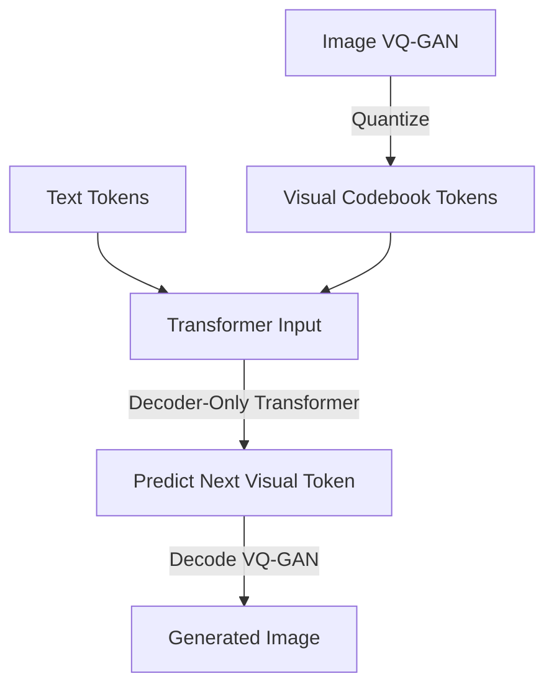

# Autoregressive Text-to-Image Models

### Introduction
Autoregressive models treat image generation as a sequence completion task, identical to how Large Language Models (LLMs) generate text.

### Architecture
- **Vector Quantized Autoencoder (VQ-GAN/VQ-VAE):** Learns a codebook of discrete visual tokens. An image is compressed into a grid of these discrete tokens.
- **Decoder-Only Transformer:** Concatenates text tokens and visual tokens. The model is trained to predict the next visual token autoregressively, given the prefix of text and previous visual tokens.
- **Generation:** During inference, visual tokens are sampled one-by-one. Once the sequence is complete, the VQ-GAN decoder converts the tokens back into pixel space.

### Key Models
- **DALL-E (Original, 2021):** Proved that scaling autoregressive transformers to text-to-image yields zero-shot generalization.
- **Parti (Google, 2022):** Showed that scaling parameters up to 20B leads to photorealistic rendering and rich spelling.
- **Muse (Google, 2023):** Used masked generative transformers to improve speed compared to step-by-step autoregressive decoding.

---

[↩ Back to Main README](../README.md)
