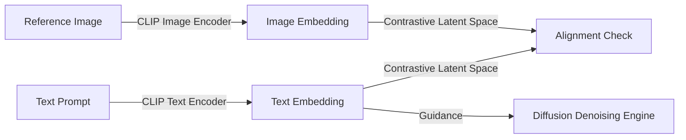

# CLIP Conditioning (Contrastive Guidance)

### Introduction
Contrastive Language-Image Pre-training (CLIP) embeddings, developed by OpenAI, were the first widely used representations for text-conditioning in diffusion models.

### Mechanism
- **Shared Embedding Space:** CLIP is trained on millions of text-image pairs using a contrastive loss, aligning the text embeddings and image embeddings in a shared mathematical space.
- **Contrastive Guidance:** The text encoder of CLIP is extracted, and its output token embeddings are fed to the diffusion model's cross-attention layers.
- **Aesthetic Alignment:** Because CLIP was trained to match images to text descriptions, its embeddings are excellent at guiding the model toward styles, color palettes, and general semantics.

### Limitations
- **Syntax Blindness:** CLIP uses a bag-of-words style pooling, meaning it struggles with complex syntax (e.g., distinguishing "a red box on a blue ball" from "a blue box on a red ball").
- **No Spelling Capability:** CLIP cannot encode fine-grained letter tokens, making it impossible to render legible text or spelling in generated images.

---

[↩ Back to Main README](../README.md)
