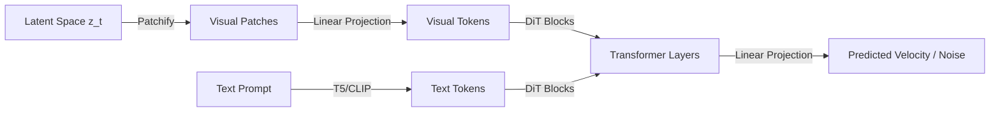

# The Diffusion Transformer & Flow Matching Era

### Introduction
Pioneered in 2024+, the Diffusion Transformer (DiT) and Flow Matching represents the modern paradigm of text-to-image systems, replacing convolutional U-Nets with scalable attention architectures.

### Key Concepts
- **Diffusion Transformer (DiT):** Replaces the U-Net with a standard Vision Transformer (ViT) style backbone. The latent image is split into spatial patches, projected into tokens, and processed via self-attention and cross-attention blocks.
- **Flow Matching:** A generative modeling framework that trains models using straight-line ordinary differential equation (ODE) trajectories between noise and data, rather than curved diffusion paths.

### Advantages
- **Excellent Scalability:** Follows standard transformer scaling laws—increasing parameters and compute leads to predictable, high-quality visual outputs.
- **Straight-Line Paths:** Flow matching reduces the curvature of the sampling trajectory, enabling high-fidelity image generation in far fewer steps (e.g., 4-10 steps).
- **Global Context:** Attention mechanisms naturally capture long-range spatial relationships, preventing structural distortions common in convolutional networks.

---

[↩ Back to Main README](../README.md)
