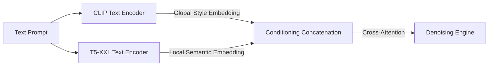

# Dual-Tower Hybrid Conditioning

### Introduction
Dual-Tower conditioning combines the strengths of both contrastive visual encoders (CLIP) and deep semantic text encoders (T5) to feed comprehensive conditioning signals to the image generator.

### Mechanism
- **CLIP Encoder:** Extracts global representations that align well with visual aesthetics, art styles, color schemes, and general classifications.
- **T5 Encoder:** Extracts detailed textual representations containing structural instructions, complex grammatical relations, layouts, and characters for text rendering.
- **Integration:** The output embeddings are concatenated or processed through separate attention towers in parallel (as in Stable Diffusion 3's MM-DiT architecture), combining the stylistic properties of CLIP with the logical compliance of T5.

---

[↩ Back to Main README](../README.md)
