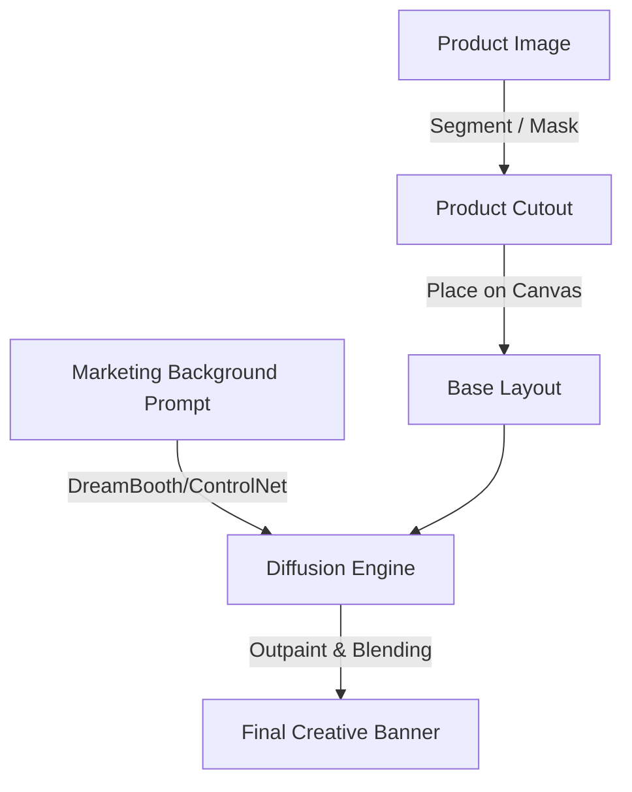

# E-Commerce Asset & Creative Marketing Generation

### Introduction
E-Commerce asset generation replaces expensive studio photography with AI-generated scenes, allowing brands to instantly render products in any environment.

### Technical Implementation
- **Subject-Driven Generation (DreamBooth / LoRA):** Fine-tunes a base diffusion model on a few images of a specific product (e.g., a handbag or a perfume bottle) so that it can be generated in novel scenes without losing its exact brand features.
- **Inpainting and Outpainting:** Placing a masked cutout of the product on a canvas and using a diffusion model to generate a matching background, ensuring lighting, shadows, and reflections are physically consistent with the object.

---

[↩ Back to Main README](../README.md)
