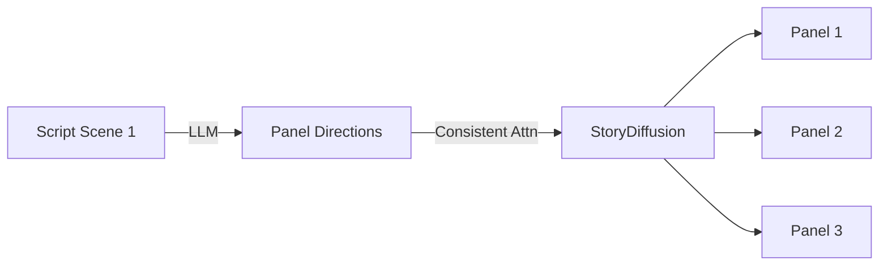

# Entertainment Concept Art & Storyboarding

### Introduction
Visual pre-visualization and storyboarding are core phases in game development and filmmaking. Modern T2I pipelines allow rapid drafting of coherent narrative sequences.

### Key Challenges & Solutions
- **Visual Consistency:** Standard models generate different character features or clothing for the same prompt. Systems like **StoryDiffusion** or **Story2Board** resolve this by linking self-attention maps across generated panels, forcing the model to reuse features (faces, clothes, backgrounds) across the sequence.
- **Interactive Refinement:** Combining diffusion models with ControlNet or image-to-image brushes, allowing concept artists to sketch layouts and use AI to render textures and lighting, speeding up pre-production from weeks to hours.

---

[↩ Back to Main README](../README.md)
