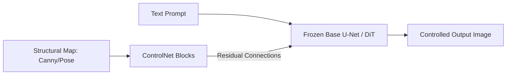

# Fine-Grained Structural Control

### Introduction
Text prompts are structurally ambiguous. Fine-grained control architectures allow feeding spatial hints (pose skeletons, edge maps, depth, segmentation) directly into the generator.

### Key Frameworks
- **ControlNet (Zhang & Agrawala, 2023):** Clones the encoding layers of the base model into a trainable copy. It takes the spatial hint, processes it, and adds the features back to the skip connections of the frozen base network. This preserves the base model's knowledge while adding precise layout control.
- **IP-Adapter (Ye et al., 2023):** An image-prompt adapter that uses a decoupled cross-attention mechanism to allow the model to accept image prompts as references (e.g., copying characters or styles) alongside text conditioning.

---

[↩ Back to Main README](../README.md)
