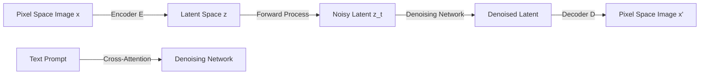

# Latent Diffusion Models (LDM)

### Introduction
Latent Diffusion Models (LDMs) form the core of modern open-weights text-to-image systems, separating the perceptual compression from the generative learning phase.

### Mechanism
1. **Perceptual Compression:** A Variational Autoencoder (VAE) compresses high-dimensional pixel arrays (e.g., $512 \times 512 \times 3$) into a low-dimensional latent space (e.g., $64 \times 64 \times 4$), removing high-frequency details.
2. **Latent Diffusion:** The diffusion model is trained to reverse a forward diffusion process (which adds Gaussian noise) entirely within this latent space.
3. **Conditioning:** Text, layouts, or semantic inputs are projected into embeddings and injected into the latent denoising network using cross-attention mechanisms.

### Mathematical Formulation
The objective function minimizes the difference between the predicted noise $\epsilon_\theta$ and the actual noise $\epsilon$ added to the latent representation:
$$\mathcal{L}_{LDM} := \mathbb{E}_{\mathcal{E}(x), \epsilon \sim \mathcal{N}(0,1), t} \left[ \| \epsilon - \epsilon_\theta(z_t, t, \tau_\theta(y)) \|^2 \right]$$
where $y$ is the text prompt conditioning and $\tau_\theta$ is the text encoder.

---

[↩ Back to Main README](../README.md)
