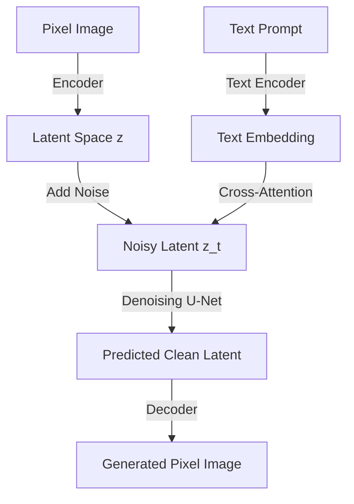

# The Latent Diffusion & U-Net Era

### Introduction
The transition to Latent Diffusion Models (LDMs) in 2022-2023 solved the extreme computational cost of pixel-space diffusion models while retaining high image quality and training stability.

### Architecture
- **Variational Autoencoder (VAE):** Compresses high-dimensional pixel-space images into a compact latent space. The diffusion process (noise addition and removal) is performed entirely in this latent space, drastically reducing compute.
- **U-Net Backbone:** A convolutional neural network with skip connections that iteratively predicts the noise added to the latents at a given timestep $t$.
- **Cross-Attention Conditioning:** Text prompts are encoded (e.g., via CLIP) and injected into the U-Net via cross-attention layers, mapping text tokens to visual latent patches.

### Key Models
- **Stable Diffusion 1.5 / 2.1:** Democratized AI art by allowing high-quality generation on consumer GPUs.
- **DALL-E 2:** OpenAI's model that used CLIP latents and diffusion in a proprietary pipeline.

### Significance
By working in latent space, training and inference times were reduced by orders of magnitude, making generative text-to-image models accessible to the public and independent developers.

---

[↩ Back to Main README](../README.md)
