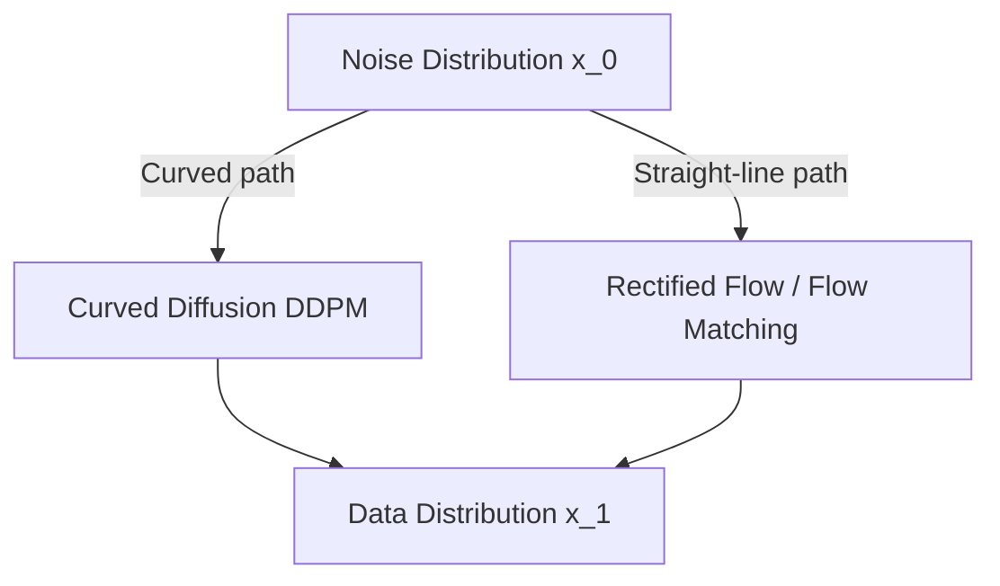

# Rectified Flow & Flow Matching Transformers

### Introduction
Rectified Flow and Flow Matching (2022+) represent a mathematical alternative to traditional diffusion (SDE-based) methods, establishing straight ordinary differential equation (ODE) paths between noise and images.

### Mechanism
- **Linear Path:** Instead of modeling the complex curved trajectories of SDEs, Rectified Flow learns a vector field that points directly from the noise distribution $x_0$ to the target data distribution $x_1$ via a straight-line interpolation:
  $$X_t = t X_1 + (1-t) X_0$$
- **Velocity Prediction:** The model is trained to predict the velocity (derivative) $\frac{d X_t}{dt}$ at any time $t$.

### Advantages
- **Fewer Sampling Steps:** Because the trajectories are straight, Euler integration requires very few steps (e.g., 4-10 steps) to solve the ODE, leading to faster inference.
- **Stable Training:** Does not rely on complex noise schedulers (like linear, cosine, or sigmoidal schedules) that require empirical tuning.

---

[↩ Back to Main README](../README.md)
