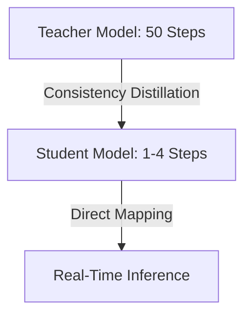

# The Sampling Latency Bottleneck

### Introduction
Standard diffusion models require 20 to 50 sequential steps to resolve an image, posing a significant latency bottleneck for real-time applications.

### Optimization Methods
- **Consistency Models (Song et al., 2023):** Train the model to map any point on the ODE trajectory directly to the origin (the clean image), enabling single-step or few-step generation.
- **Latent Consistency Models (LCM, Luo et al., 2023):** Apply consistency distillation to latent space models like Stable Diffusion, allowing high-quality generation in 2-4 steps.
- **Adversarial Distillation (e.g., SDXL-Turbo / Additive Adversarial Diffusion):** Combine adversarial training (GAN losses) with diffusion distillation to generate sample images in a single forward pass.

---

[↩ Back to Main README](../README.md)
