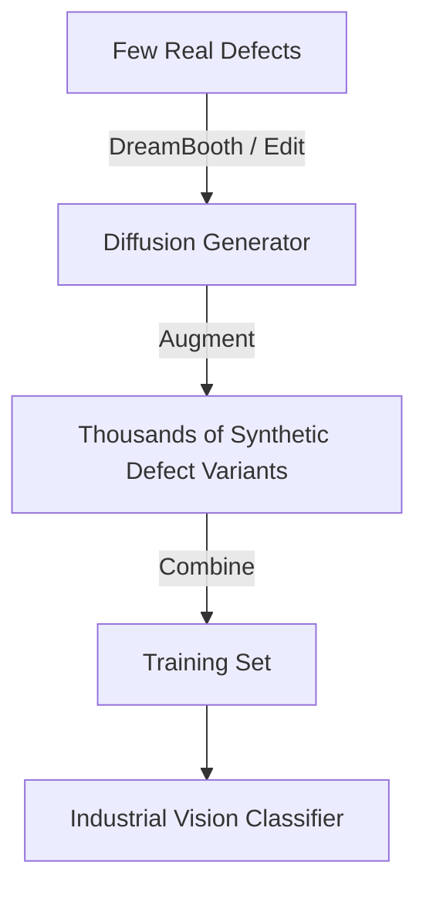

# Synthetic Data Augmentation

### Introduction
For machine vision systems (e.g., detecting defects in manufacturing, autonomous driving edge-cases), collecting real training images is often slow, expensive, or dangerous.

### Implementation
- **Semantic Data Augmentation (e.g., DA-Fusion):** Generates variation in training datasets (e.g., adding snow, rain, glare, or varying object colors) while keeping class labels intact.
- **Class-Conditional Generation:** Generates synthetic samples for under-represented classes (e.g., rare cancer types or specific factory machinery defects) to solve class imbalance problems in downstream classification models.

---

[↩ Back to Main README](../README.md)
