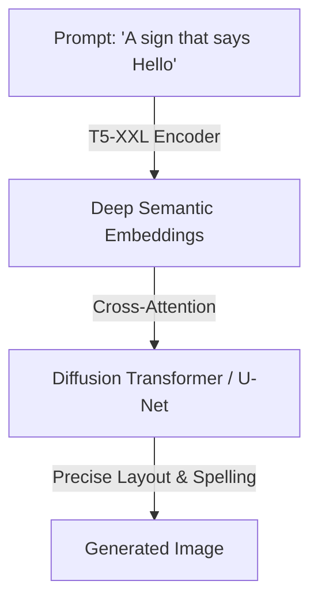

# T5/LLM Conditioning (Deep Semantic Guidance)

### Introduction
To overcome the semantic limitations of CLIP, Google's Imagen (2022) proposed conditioning text-to-image models on massive, frozen text-only Large Language Model (LLM) encoders like T5-XXL.

### Mechanism
- **Deep Semantics:** Large language models trained on massive text corpora contain deep representations of grammar, spatial relations, negation, and abstract concepts.
- **Character-Level Tokenization:** LLM tokenizers (like T5) capture sub-word and character-level embeddings more effectively than CLIP.
- **Scale:** Scaling the text encoder (e.g., from CLIP's 100M parameters to T5-XXL's 4.6B parameters) improves text adherence and spatial layout accuracy significantly more than scaling the visual diffusion model itself.

### Key Milestones
- **Imagen (2022):** Demonstrated that T5-XXL drastically outperforms CLIP in prompt alignment and spelling.
- **FLUX.1 / SD3 (2024):** Incorporate T5-XXL as the default semantic tower for generation.

---

[↩ Back to Main README](../README.md)
